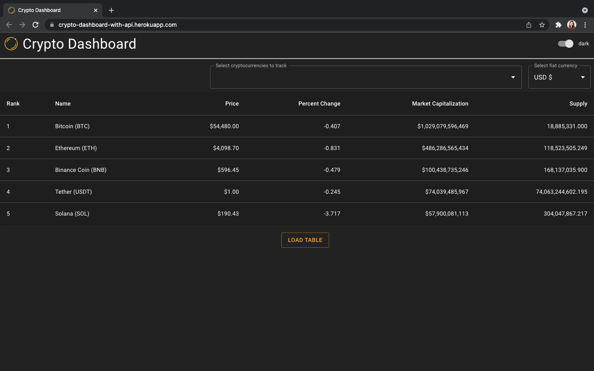
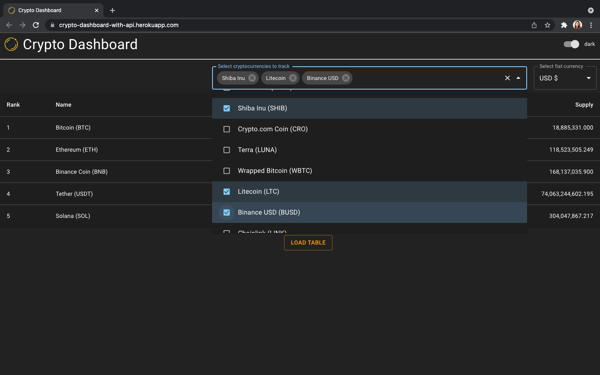
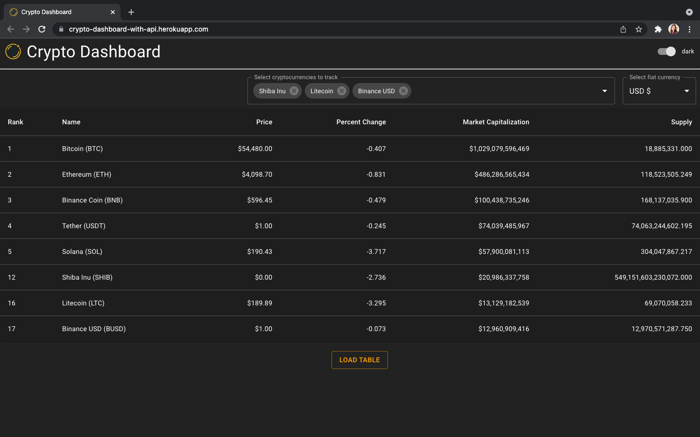
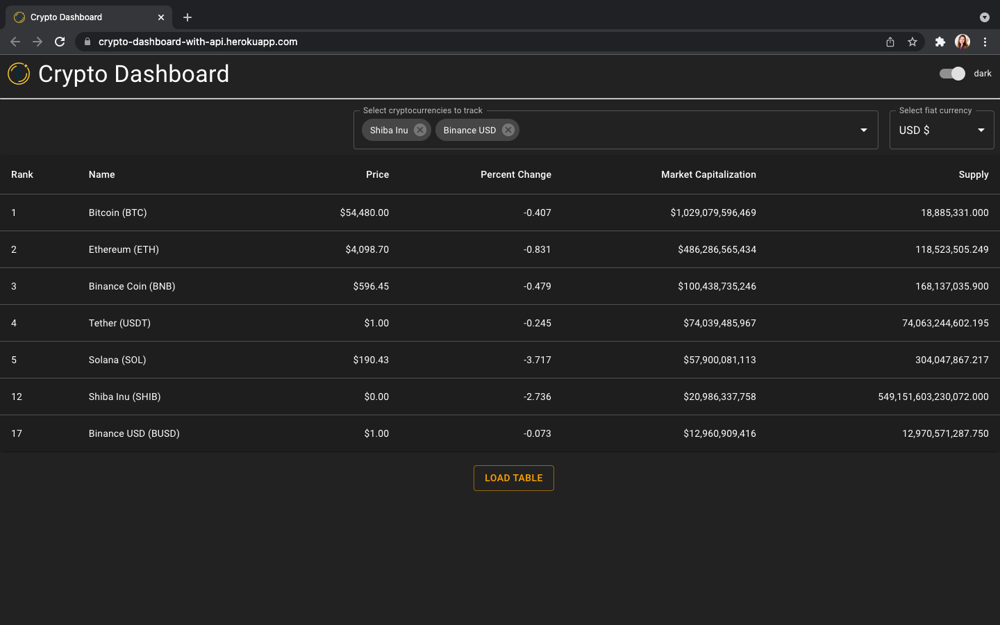

# Crypto Dashboard

[Crypto Dashboard](https://crypto-dashboard-with-api.herokuapp.com/) pulls latest cryptocurrency data to showcase price, market cap, supply, etc.  User can dynamically add additional cryptocurrencies to track in the table.

## Overview:

- App
 - Header
  - Toggle
 - Dashboard
  - CryptoSearch
  - FiatSelector
  - Price Table
   - Row
   - LoadTable

## User interactions:
- Dark mode
- Search cryptocurrencies to dynamically add to the table
- Select fiat currency
- Table header tooltip explains relevant concepts on mouseover

## Material-UI components:
- Typography
- Switch
- Autocomplete
- TextField
- Table
- Tooltip

## Architectural pattern:

- MVVM

## Backend:
- Express server (GET, POST, DELETE selected cryptocurrencies)

## 3rd-party API:
- [CoinGecko](https://www.coingecko.com/en/api/documentation)
  - Payload:
  - Response:

## Accessibility considerations:

- Provide alt text on image (i.e. crypto logo)
- Ids and labels create proper markup for screenreaders
- Dark and light themes provide sufficient contrast between text and background color
- Avoid red / green colors that are difficult for colorblind individuals to disambiguate

## Installation and set up:
- Using the command line, `git clone https://github.com/NicoleJaneway/crypto-dashboard.git`
- `npm run build` to create an optimized production build
- `npm start` to deploy

## Screenshots:

#### Base table compares top 5 cryptocurrencies by market cap
*Makes a GET request to 3rd-party API*

#### Search functionality allows user to add additional cryptocurrencies from the top 100 to the table
*Each change to the currencies selected makes a POST / DELETE request to Express backend*

#### Load button adds selected cryptocurrencies to the table
*Makes a GET request to Express backend*

#### Removing a cryptocurrency from the selected list will also remove it from the table the next time the table is loaded
*Makes a DELETE request to Express backend*

